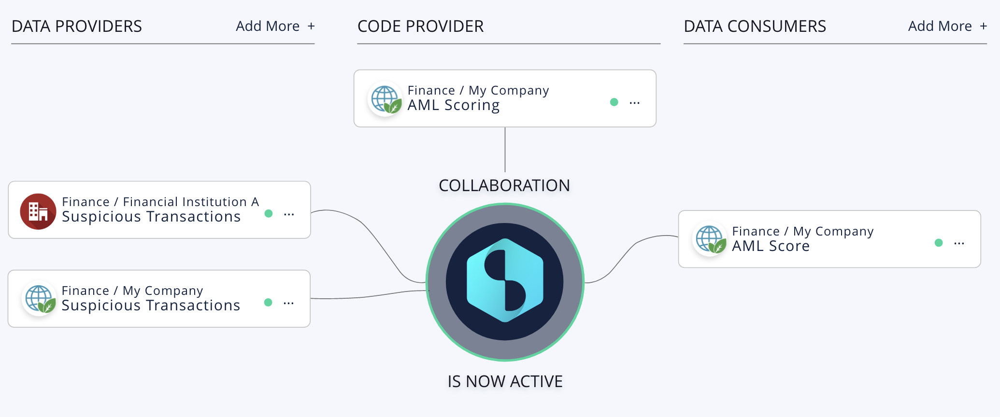

# How Datavillage Works
In a nutshell, the collaboration owner creates a collaboration space and invites participants as data providers, algorithm providers, or insights consumers. Multiple roles can be assumed by a single participant.

Data providers connect their encrypted data via custom APIs or available data connectors, algorithm providers publish their algorithm via Dockerfile and data consumers consume the result via custom APIs, webhooks or data connectors. 

The Datacage associated with the collaboration space handles the events (batch or real time), executes the algorithm on the decrypted data (only the algorithm can access the data in clear) and the result is made available to insightsx consumers in an encrypted way. The Datacage verifies authorization, consent (if required from individuals) and keeps track of all data activity in an immutable audit trail.

## Overview

Data Providers are the organizations that link their data to the collaboration space and [<b>Data Connectors</b>](docs/page2.md/#heading2) are how they can connect their data in a fully encrypted way.

Code Providers or Algorithm Providers are the organizations that publish their algorithm in the collaboration and [<b>Algorithm Models</b>](docs/page2.md/#heading2) are examples of typical algorithms (rule-based, AI- and ML-based or knowledge graphs based) running in the confidential environment, being able to handle the events sent to the collaboration space and to execute to provide an encrypted result on the combined data of the data providers.

Data consumers are the organizations that get access to the decrypted result of the confidential treatment and can use this result with the guarantee that it has been calculated with the agreement of the participants and in compliance with the regulations.

## Sources for connecting data
You can connect all types of data such as personal data, sensitive data or proprietary data with the guarantee that the data will never be decrypted except by the trusted algorithm associated with the collaboration space.

### Connecting Enterprise Data
[<b>Enterprise data connectors</b>](docs/page2.md/#heading2) are Datavillage's powerful way to connect large data sets from any data provider on any cloud provider without the need to copy and transfer all the data into the collaboration  space. Fresh data is directly accessible and used. With end-to-end encryption as well as "in-use" encryption, data is processed in encrypted memory ensuring privacy and control.
### Connecting Personal Data
[<b>Personal data connectors</b>](docs/page2.md/#heading2) are the way Datavillage connects personal data while ensuring control and privacy for individuals. Personal data is accessible through a granular consent mechanism and are processed in encrypted memory. 

### Connecting with custom APIs
[<b>Custom APIs</b>](docs/page2.md/#heading2) can be used to push and pull data. The mechanism is mainly used for data providers relying on legacy systems. Data are transfered into the collaboration space and remain encrypted at rest an in use.

## How you can process data
### Building and publishing algorithm
Building and publishing an algorithm is very simple. To build your algorithm you can base yourself on available [<b>models</b>](docs/page2.md/#heading2) or start from scratch. You publish your algorithm through standard Docker containers that you connect through your Docker registry to the collaboration space.
The supported language today is Python
### Executing algorithm
The algorithm can be executed in batch or in (near) real time. Execution can be triggered through events sent to the collaboration space and processed by the algorithm in the confidential environment.
### Enabling transparency and explainability
An algorithm descriptor is required with the algorithm published in the collaboration space. It describes its purpose and how it works. Explainability can be handled through encrypted outputs to result consumers.
## Where you can share results
The results can be shared in an encrypted way towards the result consumers either through information accessible in the collaboration space or through webhook exposed by the result consumer. The result must correspond to the structure, format and types of data defined and approved by the collaboration space.

