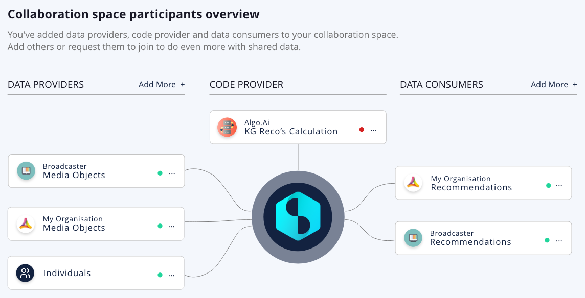
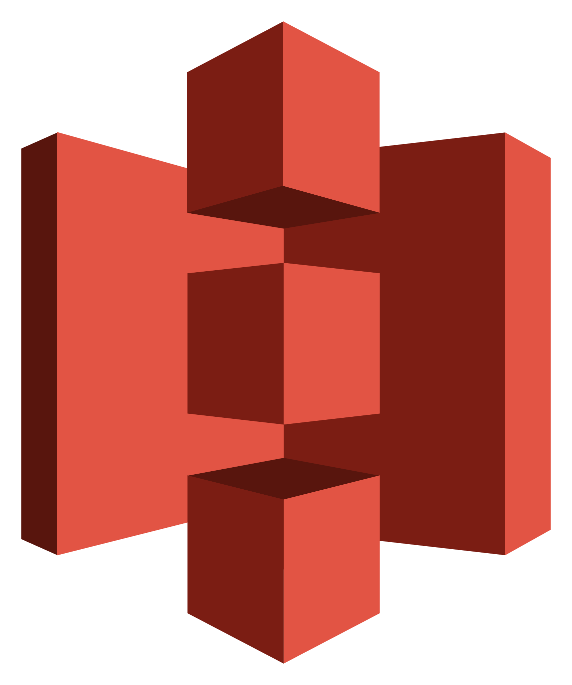
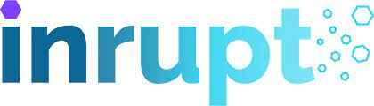

Datavillage enables organizations to collaborate on data with other organizations and their consumers with privacy. Organizations gain access to sensitive and personal data of other parties while confidentiality and integrity of data and algorithms are guaranteed.
Organizations and consumers can share data without fear of it being misused or of losing their competitive advantage. It’s about <b>sharing without showing</b>.

Datavillage provides the <b><u>D</u>ata <u>C</u>ollaboration <u>P</u>latform</b> implementing privacy by design and automating trusted and transparent insights generation.

Privacy by design is implemented based on end-to-end data encryption and transparent governance:
- Data are encrypted at rest and in transit
- Data are encrypted while beeing processed
- Confidential algorithm is running is a fully sandboxed environment
- Only derived data can be accessed by data consumer
- Consumers are in control of their data and can join collaborations with explicit consent

## Data collaboration spaces
Organizations can create <b>data collaboration spaces</b> involving other organizations and their consumers directly. The participants meet in the confidential environment:
- The <b>data providers</b> that provide the raw data. The data providers can be organizations providing enterprise data or consumers directly connecting zero-party personal data through their data vault. The data is only visible in the secure environment by the trusted algorithm.
- The <b>code provider</b> that provides the algorithm that will run on the data. The code provider describes the algorithm and the output model (ontology) for derived data.
- The <b>data consumers</b> who access the results of the algorithm (derived data). Only data consumers can access the result from the confidential environment. Consumers get result directly in their personal data vault.

As illustrated in the diagram below, a participant can have several roles.

## End-to-end confidentiality
End-to-end confidentiality guarantees each participant a <b>complete level of control and transparency</b> over the collaboration:
- The <b>identity</b> of each participant both organizations and consumers is known and validated
- The <b>data</b> can only be accessed in the confidential environment by the approved code. Personal data are stored in the data vault of consumers.
- Only the <b>derived data</b> (results) can leave the confidential environment by the authorized participant
- The <b>purpose</b> of the collaboration is validated by each participant including consumers via their explicit consent
- The <b>attestation</b> that the confidential environment is indeed a trusted environment and complies with the requirements
- The confidential environment, also called `Datacage`, operates on TEE enclaves, sanboxed via micro-firewalls.

# Participants SDK
Software development kit and code snippets for participants of a collaboration space.

## Data provider SDK
There are two different ways to connect data with the Datacage:
- <b>Push</b> approach where the data provider will push the data, encrypted beforehand with the public key received during the verification of the attestation (a flow based on the exchange of symmetric keys is also possible for large datasets).
<i>The push model is recommended for datasets that do <b>not require frequent synchronization</b>.</i>

- <b>Pull</b> approach where the Data Provider will pull the data from the Datacage. The data can be pre-encrypted on the data provider side, but we recommend transport layer security where the mutual authentication certificate is created and verified based on the enclave key.
<i>The pull model is recommended for datasets that <b>do require more frequent synchronization</b>.</i>

These are the `Data provider connectors` currently supported by the platform:
### Enterprise data systems
 

Connect enterprise data from amazon S3 buckets (Push) 

Connect enterprise data from Azure blob storage (Push) 

### Personal data systems (data vaults)
 

Connect directly Enterprise Solid Server (Inrupt) from consumers as data provider (Pull) 

Connect directly Solid Community Server from consumers as data provider (Pull) 

## Code provider SDK
The [Python SDK](https://datavillage-me.github.io/dv-utils/) allows the code provider to quickly write an algorithm that can work and access the functionality of the `Datacage`.

### Development languages and tools
 

Use Python as development language for the algorithm

Use Notebook to build your algorithm (on sample datasets) 

## Data consumer SDK
The data consumer SDK is under construction.

