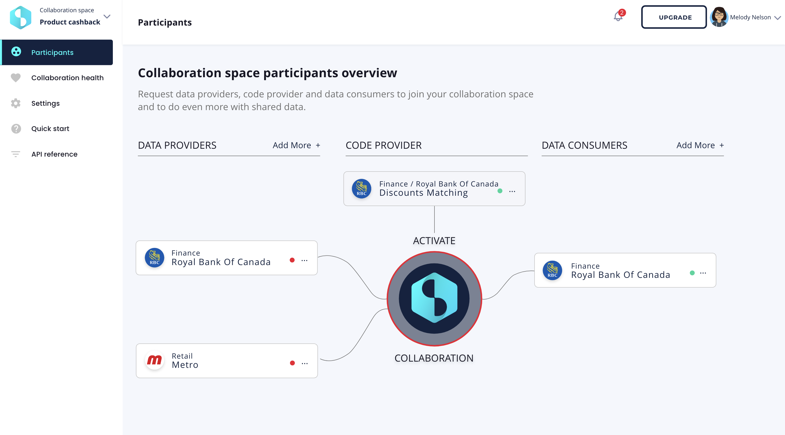

# Setting up a Collaboration Space

## Create a Collaboration Space

This requires **MGR** privileges for client used as owner.

=== "Console"

    ```

    ```

=== "HTTP"

    ```

    ```


=== "CLI"

    ```bash
    # the Client ID of the Owner must be provided
    $> datavillage space create MyNewSpace 63ff2995c37e866eff4b8634
    
    # Get the list of collaboration spaces that the current user has access to
    $> datavillage space list
    ```

=== "TypeScript"

    ```typescript
    import { getRemoteClient } from '@datavillage-me/api';
    
    const client = getRemoteClient('https://api-dev.datavillage.me');
    
    const spaceServices = client.getCollaborationSpacesServices();
    
    let space = await spaceServices.createCollaborationSpace(
      {
        owner: testClient.id,
        name: "Test Space",
        category: "test",
        description: "A test collaboration space",
        sandboxing: {
          enabled: false,
          allowed: []
        },
        enclaving: {
          enabled: false
        }
      });
    
    ```

## Invite Collaborators


=== "Console"

    

=== "HTTP"

    ```

    ```

=== "CLI"

    ```bash
    # The collaboration space ID must be provided
    $> datavillage space add 63ff30d9d2b0b893c4b5868a
    
    # set the algo settings
    $> datavillage space code set 63ff30d9d2b0b893c4b5868a
    ```

=== "TypeScript"

    ```typescript
    
    
    ```
