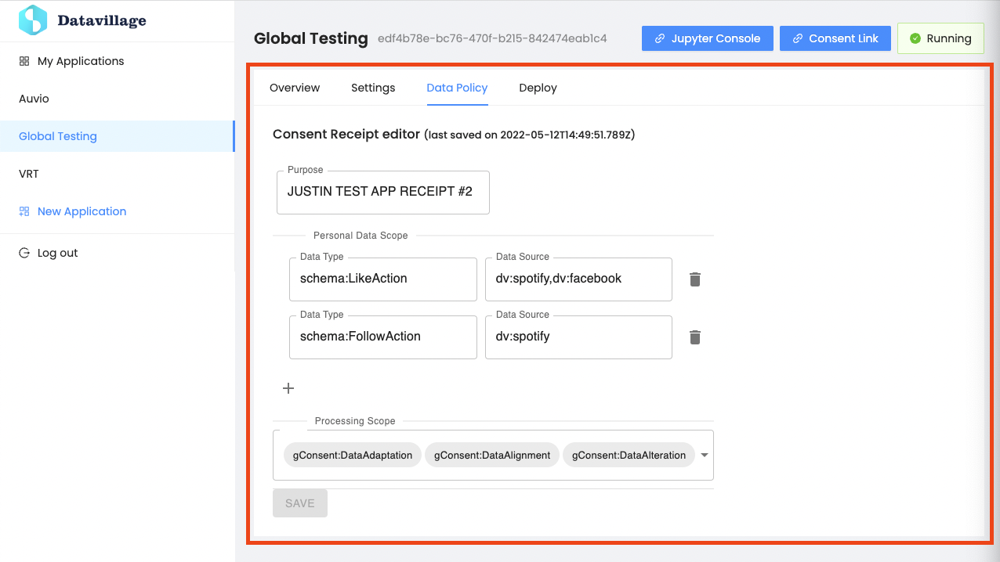

# Data Policy

{: .no_toc }

---

The data policy section allows the edition of POD access requested to user when they sign in to the application.

## Purpose

Free text field where you can describe the prupose of the application and why the requested personal data are necessary
for the application. This will be directly exposed to the users.

## Personal data scope

This specifies exhaustively the data that the application will access in the user POD. The `Data Type` represents the
type of personal data and the `Data Source` is the provider of the data.  
Here is a list actually supported data sources with their types.

| Data source    | Data source identifier   | Available data types |
|:---------------|:---------------------|:-------------------------|
| `Spotify` | `dv:spotify` | `schema:LikeAction` `schema:DislikeAction` `schema:FollowAction` `schema:BookmarkAction` `schema:ListenAction` |
| `Facebook` | `dv:facebook` | `schema:LikeAction` |
| `RTBF Auvio` | `dv:auvio` | `schema:LikeAction` `schema:DislikeAction`|
| `VRT` | `dv:vrt` | `schema:LikeAction` `schema:DislikeAction` |

## Processing Scope

Application Data Policies are stored [gConsent ontology](https://openscience.adaptcentre.ie/ontologies/GConsent/docs/ontology) instances. This ontology defines GDPR consent scopes, the relevant scopes have to be selected in the dropdown list.  