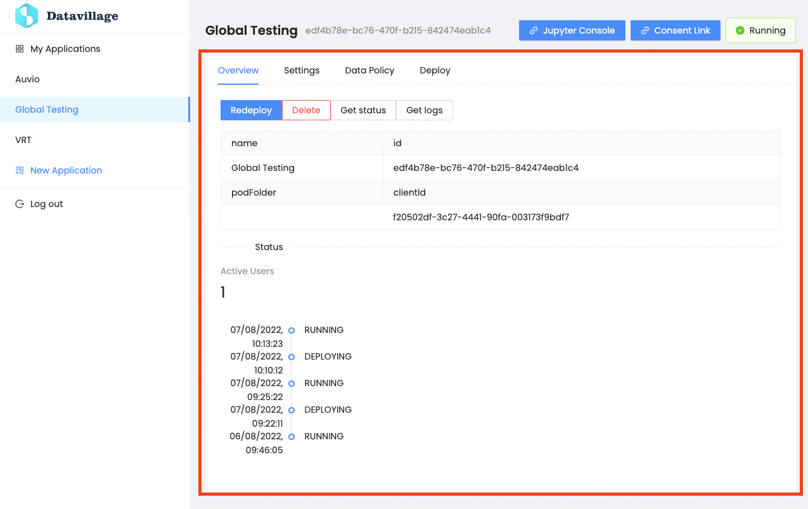

# Overview
{: .no_toc }
---

The overview is the first and default section of the application details page.

## Application actions

You can take multiple actions on your application from there:

1. `Deploy` / `Redeploy` your algorithm to the cage.
2. Delete your application from the cage (only the algorithm will be deleted, you will be able to deploy later).
3. `Get Status` of the cage
4. `Get Logs` from the cage

## Application details

Some application details (read only)

## Active users

This is where you can see the number of users that have signed the consent through the passport web application accessible from `Consent Link` in the [header section]({{ site.baseurl }}).

## Recent status history

From there you can have a view on the 5 latest application status.
By hovering the status, you can view some details of it.