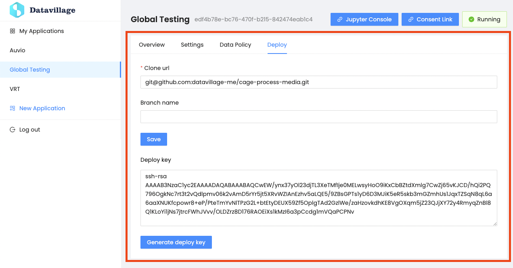
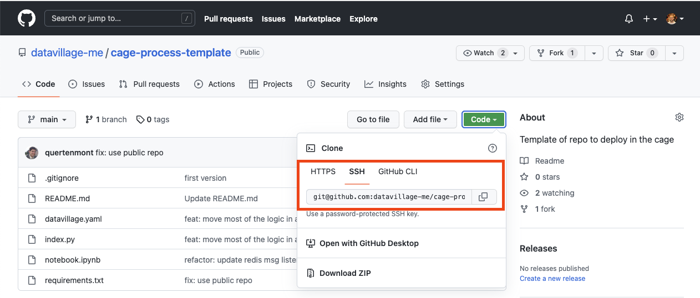

# Deploy

{: .no_toc }

---

Connect the trusted code to be deployed in the `Datacage`. 

## Set up your own algorithm

1. Go to [template Datavillage repository](https://github.com/datavillage-me/cage-process-template) and fork it.
2. If the branch to deploy isn't the default repository branch, you can set it in the `Branch name` field.
3. Click `Save` to save your repository and the branch to deploy.    
4. Write your own algorithm using the provided utility python library to interact with the Datavillage services. This library allows your algorithm to access needed inforamtion such as:
   
   |:---------------|
   | `Getting list of registered users` |
   | `Getting registered user data` |
   | `Getting application settings` |
   | `Saving algorithm result to user's pods` |
   | `Saving algorithm explains to user's pods` |
   
   If you don't want to use the library, you can also make the http calls inside the algorithm. A OpenAPI documentation is available ths [API section]({{ site.baseurl }})

5. Enter the clone SSH git url of your repository. For GitHub you can find this URL here:

   

6. Click the `Generate deploy key`, this will generate a public key and display it in the `Deploy key` text area. Copy this key and save it to your repository settings. For GitHub, you can follow these [steps](https://docs.github.com/en/developers/overview/managing-deploy-keys#setup-2) and skip the first 3 as Datavillage generates the key for you.  

