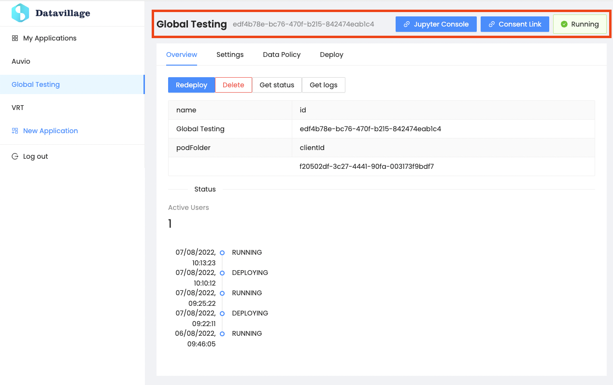

# Header
{: .no_toc }
---

Keep track of information, status of your collaboration space.

The header section contains multiple components (from left to right):

1. Application name.
2. Application internal ID.
3. If enabled in settings: the `Jupyter Console` access link to interact and test the application algorithm in your notebook.
4. The `Consent Link` from where you will be able to sign in your application with a user account.
5. Status of the collaboration space `Datacage`.