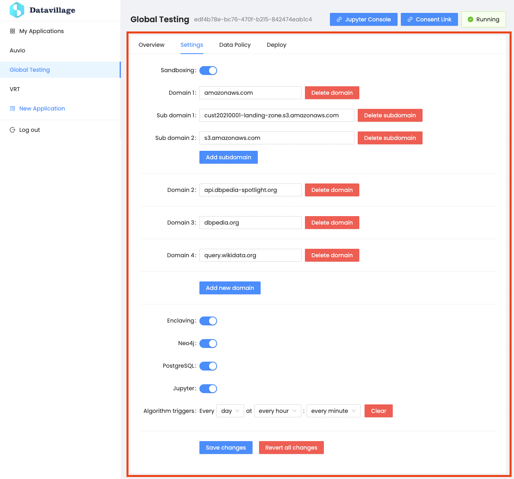

# Overview
{: .no_toc }
---

Edit your collaboration space  settings. Please note that the changes are NOT saved automatically, you need to save them manually to see them applied.

## Sandboxing

By default, the `Datacage` isn't sandboxed, this means that the `Datacage` doesn't block any connection to any external services. When toggled on, you can still allow some connections by defining the allowed addresses.

## Enclaving
When toggled on, the `Datacage` is deployed on TEE enclaves.

## Neo4j
When toggled on, Neo4J database service is deployed.

## PostgreSQL
When toggled on, PostgreSQL database service is deployed.

## Jupyter
If enable, you can access your Jupyter notebook from the link in the [header section]({{ site.baseurl }}).

## CRON triggers