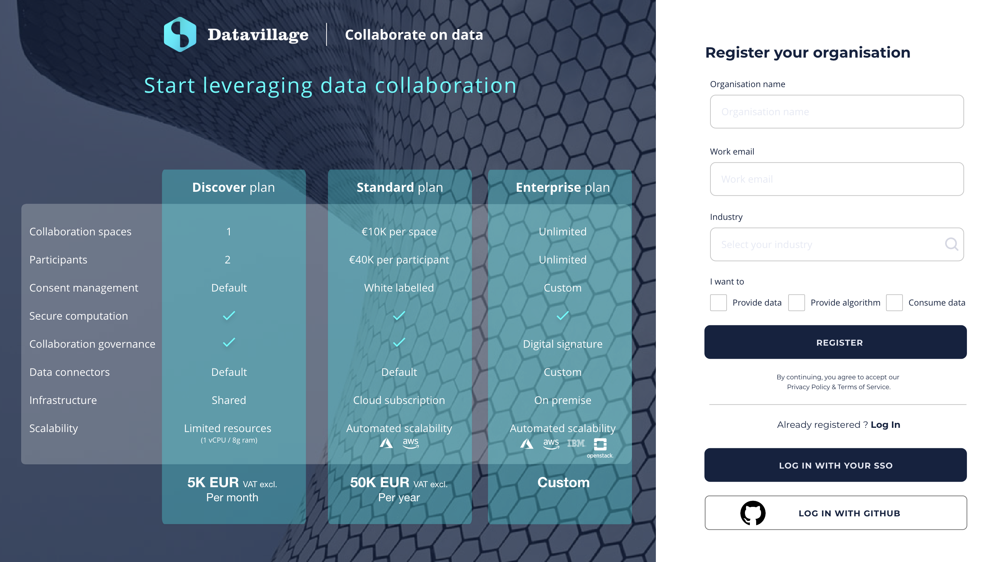
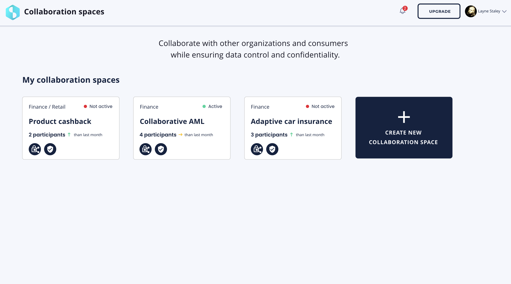

# Getting started

## Register your organization

1. Go to the [collaboration console](https://www.datavillage.me/console) and register your organization.
2. You will receive an email to confirm your registration and log in as the first employee - owner of the collaboration space.

## Create a new collaboration space

1. Click the `New Collaboration Space` button present on the home page. 

2. Enter the your collaboration space preferences.

2. Confirm the creation.

## Invite participants

1. Click on the `Add more` button for data providers to ask participants to join the collaboration space. Add yourself if your organization is itself a data provider.
2. Click on the `Add more` button for code provider to ask the participant to join the collaboration space. Add yourself if your organization is itself a code provider (only one code provider per collaboration space).
3. Click on the `Add more` button for data consumers to ask participants to join the collaboration space. Add yourself if your organization is itself a data consumer.

## Next steps
Go to the Console menu to see how the Collaboration Console helps you describe, manage, and perform your collaboration as a confidential data product.

