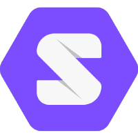

# Participants SDK
{: .fs-8 }

## Data provider SDK

## Code provider SDK
The [Python SDK](https://datavillage-me.github.io/dv-utils/) allows the code provider to quickly write an algorithm that can work and access the functionality of the `Datacage`.

## Data consumer SDK

## Available integrations

### Cloud providers
 

Deploy the `Datacage` on Aws

Deploy the `Datacage` on Azure

### Data pipelines
 

Connect enterprise data from amazon S3 buckets 

Connect enterprise data from Azure blob storage 

### Personal information systems
 

Connect directly Solid POD's from consumers as data provider

### Development languages and tools
 

Use Python as development language for the algorithm

Use Notebook to build your algorithm (on sample datasets) 