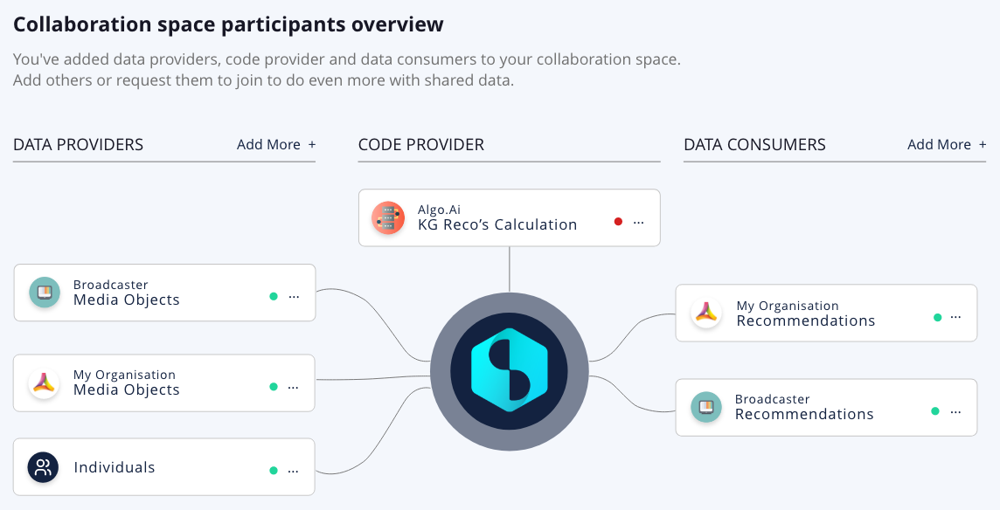

# Privacy-preserving data collaboration
{: .fs-8 }

Datavillage enables organizations to generate new insights through <b>zero-trust collaboration</b>. Organizations gain access to sensitive and personal data of other parties while confidentiality and integrity of data and algorithms are guaranteed.
Organizations and individuals  can share data without fear of it being misused or of losing their competitive advantage. It’s about  <b>sharing without showing</b>.

Datavillage provides the <b>privacy-preserving data collaboration platform</b> and <b>developer APIs</b> implementing privacy by design and automating trusted and transparent data collaboration.

Privacy by design is implemented based on end-to-end data encryption and transparent governance:
- Data are encrypted at rest and in transit
- Data are encrypted while beeing processed
- Confidential algorythm is running is a fully sandboxed environment
- Only derived data can be accessed by data consumer
- Individuals are in control of their data and can join collaborations with explicit consent

## Data collaboration spaces
Organizations can create <b>data collaboration spaces</b> involving other organizations or even their consumers directly. The participants meet in the neutral collaboration space:
- The <b>data providers</b> that provide the input data. The data providers can be organizations providing enterprise data or individuals directly connecting their personal data through a consent mechanism. The data is only visible in the secure neutral environment by a trusted algorithm.
- The <b>code provider</b> that provides the algorithm that will run on the data. Only the trusted algorithm will have access to the data in the neutral environment to process them.
- The <b>data consumers</b> who access the results of the algorithm (derived data). Only data consumers can access the result within the neutral environment.

As illustrated in the diagram below, a participant can have several roles.

## End-to-end confidentiality
End-to-end confidentiality guarantees each participant a <b>complete level of control and transparency</b> over the collaboration:
- The <b>identity</b> of each participant both organizations and individuals is known and validated
- The <b>data</b> can only be accessed in the neutral environment by the approved code
- Only the <b>derived data</b> (results) can leave the neutral environment by the authorized participant
- The <b>purpose</b> of the collaboration is validated by each participant including individuals via their explicit consent
- The <b>attestation</b> that the neutral environment is indeed a trusted environment and complies with the requirements
- The neutral environment, also called `Datacage`, operates on TEE enclaves, sanboxed via micro-firewalls and hardened via GVisor.